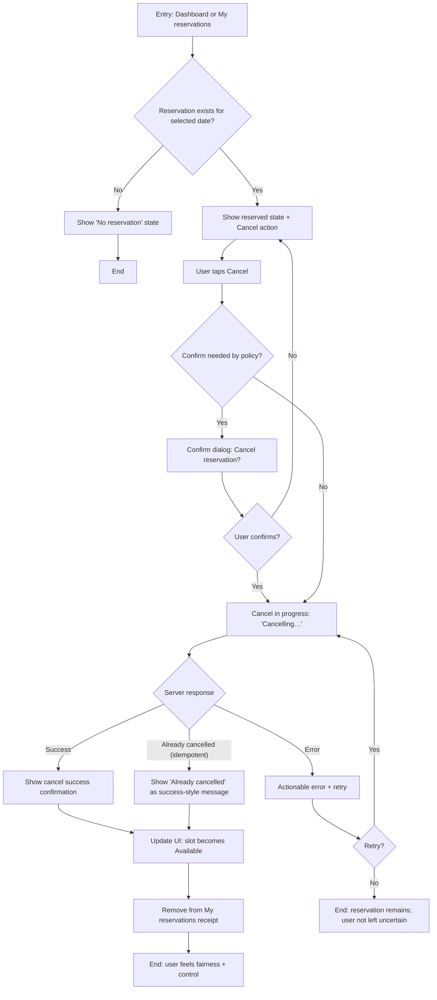

# UX Design Specification poc-bmad

**Author:** Chirath.vandabona
**Date:** 2026-03-18

---

<!-- UX design content will be appended sequentially through collaborative workflow steps -->

## Executive Summary

### Project Vision

poc-bmad is an internal web app that replaces parking uncertainty with a clear commitment: employees can select a date, see which parking slots are available, reserve one, and manage (cancel) their reservations. The UX goal is transparent, low-friction allocation that users can trust.

The product is explicitly production-oriented: SSO-based identity is mandatory, reservations are persisted in a durable database, and support/admin users have tools to investigate disputes and perform controlled corrections with an audit trail.

### Target Users

- Employees who drive to the office and need a guaranteed parking slot on specific days (mobile + desktop web).
- Support/Admin users (helpdesk/facilities/IT) who search reservations, review audit history, and apply corrective actions (cancel/reassign) with operator identity and reason recorded.

### Key Design Challenges

- Trust and clarity under concurrency (e.g., handling “slot already reserved” conflicts with clear recovery).
- Fast, low-friction mobile-first interactions for date selection and slot selection (tap targets, grid scanning, responsive layout).
- Balancing usability with privacy (what reservation details are visible to employees vs reserved-only).
- Safe support/admin correction workflows (guardrails, confirmations, reason capture, audit visibility).

### Design Opportunities

- Make “pick a date → reserve” feel instantaneous through defaulting, fast date navigation, and glanceable availability.
- Provide clear, accessible feedback for success, conflict, and cancellation states (including focus management and screen-reader-friendly messaging).
- Reinforce trust via consistent state presentation (“My reservations” as source of truth) and explicit status messaging during updates/refresh.

## Core User Experience

### Defining Experience

The core experience is “I need to come to the office on a specific day → I can quickly confirm whether I’ll have parking → I reserve a slot and feel confident it’s mine.”

This experience should feel:
- Fast: users can complete reservation in seconds with minimal decisions.
- Trustworthy: the UI clearly communicates availability and reservation outcomes, especially under contention.
- Mobile-friendly: the primary flow works comfortably on a phone as well as desktop.

Secondarily (for a smaller audience), the support/admin core experience is “I can quickly find a reservation by employee/date/slot, understand what happened via audit history, and apply a controlled correction with reason—safely and traceably.”

### Platform Strategy

- Primary platform: responsive web app (mobile + desktop browsers).
- Interaction modes: touch-first on mobile; keyboard/mouse on desktop.
- Accessibility baseline: keyboard operability, clear focus states, accessible labels/names, and screen-reader-friendly error announcements for the main flows (date selection, reserve, cancel).
- Offline: not required for Phase 1; design should degrade gracefully if the network or backend is unavailable (clear error states, no ambiguous “maybe reserved” outcomes).

### Effortless Interactions

- Date selection should be quick (sensible default date, easy next/previous navigation).
- Availability should be glanceable (clear “available” vs “reserved” state with consistent visual language).
- Reserving should be one deliberate action with immediate, unambiguous feedback (success or conflict).
- Cancelling from “My reservations” should be frictionless but safe (confirmation pattern appropriate to policy; idempotent behavior reflected in UX).
- Recovery from conflict (“already reserved”) should be immediate: users can instantly choose another slot without losing context.

### Critical Success Moments

- The “I have a spot” moment: after reserve, the user sees a clear confirmation and the reservation appears in “My reservations” for that date.
- The “trust is preserved under contention” moment: if a slot becomes unavailable, the user gets a clear conflict outcome and an easy path to pick another slot.
- The “fairness in action” moment: when a user cancels, they see the slot become available again for that date (and their list updates).
- For support/admin: the “I can resolve this safely” moment: search → audit clarity → controlled correction with reason captured and clearly recorded.

### Experience Principles

- Commitment over uncertainty: always show a definitive state and outcome; avoid ambiguous UI.
- Speed with clarity: minimal steps, but never at the expense of understanding (especially for errors/conflicts).
- Mobile-first by default: design controls and layouts for touch and small screens first.
- Privacy by design: show only what employees need to act; reserve identities/details for authorized support/admin views.
- Auditability is part of the UX: support/admin actions must make “who did what and why” explicit.

## Desired Emotional Response

### Primary Emotional Goals

Employees:
- Confidence and certainty: “I know I have a spot on that date.”
- Trust and fairness: “The system is transparent and I’m treated fairly.”
- Calm efficiency: “This takes seconds and doesn’t require thought.”

Support/Admin:
- Control and clarity: “I can quickly understand what happened and resolve it safely.”
- Accountability and protection: “Actions are traceable; I’m protected by the audit trail.”

### Emotional Journey Mapping

- Discovery / first use: Relief and curiosity (“Finally—this solves the parking uncertainty.”)
- During date selection and scanning availability: Calm control (clear, glanceable states; no confusion).
- Reservation moment (commit): Confidence and accomplishment (clear confirmation, visible in “My reservations”).
- Pre-arrival / day-of: Reassurance (“I have a spot; I know what to do if there’s an issue.”)
- Returning later: Stability (“My reservation is still there; I can rely on it.”)
- When something goes wrong (conflict, errors): Supported—not blamed (clear explanation, quick recovery, no ambiguity).
- Cancellation: Fairness and ease (“I can release the spot quickly; someone else can use it.”)

Support/Admin journey:
- Investigation: Clarity (“I can find the record fast and see the audit history.”)
- Correction: Safety and accountability (guardrails + reason capture + explicit result)

### Micro-Emotions

- Confidence over confusion: strong labeling, consistent states, predictable outcomes.
- Trust over skepticism: deterministic outcomes; no ambiguous “maybe reserved” states.
- Calm over anxiety: conflicts treated as normal, recoverable outcomes.
- Respect over intrusion: employee privacy preserved; sensitive details only in authorized views.
- Safety over fear (support/admin): “I won’t accidentally make it worse.”

### Design Implications

- Confidence → make outcomes unambiguous: explicit success confirmations, updated views, “My reservations” as the reliable contract.
- Trust/fairness → use neutral language: “Someone else reserved this just before you” vs. blamey messaging; show clear next steps.
- Calm efficiency → minimize steps: defaults, fast date navigation, glanceable availability.
- Protect the “betrayal moment” (conflict) → preserve context and enable immediate alternate choice; avoid unclear refresh behavior.
- Protect the “arrival moment” → provide an obvious escalation/help path (“Spot occupied?” → what to do) so users don’t feel abandoned.
- Safety for support/admin → guardrails: preview of change, confirmations for destructive actions, mandatory reason for corrections, and clear audit visibility.

### Emotional Design Principles

- Make outcomes unambiguous (especially reserve/cancel/conflict).
- Treat conflicts as normal system behavior, not user error.
- Reinforce trust through consistency (dashboard and “My reservations” always agree).
- Be honest about state and failure (no stale or vague “it might have worked” messaging).
- For support/admin: clarity + guardrails + traceability at every step.

## UX Pattern Analysis & Inspiration

### Inspiring Products Analysis

**Uber**
- **What it solves elegantly:** A high-stakes, time-sensitive commitment (“my ride is coming / I’m on my way”) with minimal user effort.
- **What it does well (relevant to this project):**
  - **Clear, persistent status**: Users always know “where they are” in the flow (requested → matched → arriving → in trip → completed).
  - **Clean, glanceable UI**: The most important information is immediately visible; secondary details are available but not noisy.
  - **Confidence under uncertainty**: Even when timing changes, the UI keeps the user oriented with an updated, understandable state.

**Scope Cinemas (seat booking UX)**
- **What it solves elegantly:** Users select scarce inventory (seats) in a shared system without confusion, and complete checkout with clear progression.
- **What it does well (relevant to this project):**
  - **No double-booking behavior**: Seat selection is protected by backend rules so two users can’t buy the same seat.
  - **Temporary holds**: When a user selects a seat, it’s held for a short window (e.g., ~15 minutes) to reduce contention during checkout; if they don’t complete, the seat becomes available again.
  - **Instant feedback**: Seat state changes and selection feedback are immediate, reducing anxiety and misclicks.

### Transferable UX Patterns

- **Status-first information hierarchy (Uber)**
  - Always show the current “truth” of the user’s commitment first (for us: selected date + reservation state + “you have slot Pxx” or “no reservation”).
- **Single primary action at a time (Uber)**
  - One obvious next action (reserve OR cancel) while everything else is supportive context.
- **Persistent confirmation artifact (Uber)**
  - “My reservations” acts as the stable receipt/contract; must always agree with dashboard state.
- **Inventory selection as a state machine (Scope)**
  - Treat each slot on a date like a “seat”: available ↔ reserved (and optionally held).
- **Temporary hold pattern (Scope) — optional**
  - If we ever introduce a multi-step confirmation/checkout flow, a time-boxed hold reduces contention and user frustration.
  - If the reservation is truly one-step in Phase 1, we can skip holds and rely on deterministic conflict handling (“already reserved”) plus quick recovery.
- **Instant feedback loops (Uber + Scope)**
  - Clear loading states, immediate success/conflict messaging, and consistent refresh behavior after mutations.

### Anti-Patterns to Avoid

- Ambiguous outcomes (“Maybe reserved” / silent failures / stale availability) that recreate the core anxiety we’re trying to remove.
- UI state that disagrees across screens (dashboard vs “My reservations”), which undermines trust quickly.
- Error handling that blames the user or forces them to restart the flow after a conflict.
- “Phantom selection”: showing a slot/seat as selected when it wasn’t actually secured server-side.

### Design Inspiration Strategy

**What to Adopt**
- A **clear status model** for the reservation lifecycle (viewing availability → reserving → reserved / conflict → cancelled) presented consistently.
- A **clean, glanceable layout** that prioritizes date + current reservation state + next action.
- **Deterministic inventory rules** (no double booking), with immediate UI feedback.

**What to Adapt**
- Uber-like “live status” becomes **reservation-state clarity**: no real-time tracking needed, but deterministic outcomes + visible refresh are mandatory.
- Scope’s “hold” becomes an **optional pattern**: only adopt if we introduce multi-step reservation or payment-like confirmation.

**What to Avoid**
- Any design that makes users “double-check” whether they’re reserved.
- Any selection model that appears to secure a slot before the server confirms.

## Design System Foundation

### 1.1 Design System Choice

**Themeable system** using **Tailwind CSS** plus a curated component set (e.g., shadcn/ui-style approach) as the foundation.

### Rationale for Selection

- **Speed with consistency:** Provides production-quality building blocks (buttons, dialogs, forms, toasts) while keeping UX consistent across employee and admin/support surfaces.
- **Themeable for “clean UI”:** Enables a minimalist, status-first interface (Uber-like hierarchy) without being visually “locked” into a heavy enterprise look.
- **Good accessibility defaults (with discipline):** Component primitives can be accessible-by-default, and we can standardize focus states, labels, and error announcements to meet the app’s accessibility goals.
- **Low implementation friction:** Aligns with the existing Next.js + Tailwind direction and reduces design/dev drift.

### Implementation Approach

- Establish a small set of **UI primitives** (Button, Badge, Dialog/Drawer, Toast, Input, Select/Date picker wrapper, Table/List, Tabs).
- Standardize **feedback patterns**:
  - Toast for success confirmation (reserve/cancel) + inline error for conflicts.
  - Deterministic loading states for mutations (“Reserving…”, “Cancelling…”) that resolve quickly.
- Define core **layout patterns**:
  - “Status-first” header area (selected date + current reservation summary + primary action).
  - Glanceable grid/list patterns for slot availability.
- Ensure consistent **interaction behavior** across mobile/desktop (tap targets, hover states, keyboard navigation).

### Customization Strategy

- Create a minimal **design token set** (Tailwind theme):
  - Colors (background/surface/text, success/warn/error, reserved/available states)
  - Typography scale
  - Spacing and radii
  - Focus ring and disabled states
- Define “inventory state” visuals for slots:
  - Available vs reserved vs (optional future) held
  - Clear contrast + accessible labeling
- Keep custom UI limited to the product differentiators:
  - Slot grid/availability visualization
  - Reservation status banner / receipt presentation
  - Support/admin correction confirmation and audit presentation patterns

## 2. Core User Experience

### 2.1 Defining Experience

**Defining experience:** “Reserve a parking slot in seconds with complete confidence.”
The interaction users describe is: **select a date → instantly see what’s available → tap a slot to reserve → see an unambiguous confirmation and a persistent ‘receipt’ in My reservations.**

This is the product’s signature because it converts a stressful unknown (“will I get a spot?”) into a clear commitment (“I have P07 on Tuesday”).

### 2.2 User Mental Model

- Users approach this like **booking scarce inventory** (cinema seats / appointments):
  - A slot is either available or taken for a date.
  - If someone else takes it first, you pick another.
  - Once booked, it should feel like a contract/receipt.
- They expect:
  - **Instant feedback** on success or conflict.
  - **Consistency**: dashboard and “My reservations” always agree.
  - **Fairness**: first-come-first-serve with no surprises.
- Likely confusion points to design away:
  - “Did it actually reserve?” (avoid ambiguous loading/stale states)
  - “Why did it change?” (conflict messaging must be neutral and explanatory)
  - “What do I do if the spot is occupied?” (clear support path)

### 2.3 Success Criteria

Users say “this just works” when:
- They can complete reserve in a few seconds with minimal thinking.
- They immediately see a **clear confirmation** and the reservation appears in **My reservations**.
- Conflicts are handled clearly (“Someone else reserved it just before you”) and recovery is immediate (choose another slot without restarting).
- Cancellation is easy and the UI reflects the change promptly and consistently.
- The experience feels reliable across mobile and desktop (tap targets, keyboard support, accessible error messaging).

### 2.4 Novel UX Patterns

Primarily **established patterns**:
- Date selection + inventory grid (seats/slots)
- One-step commit with deterministic outcomes
- Receipt-style confirmation (“My reservations”)

Novelty is not required; the differentiation comes from **speed + clarity + trust** (status-first layout, strong feedback, and consistent state).

### 2.5 Experience Mechanics

**1. Initiation**
- User lands on dashboard with a date selector and availability view.
- System defaults to a sensible date (e.g., today or next business day) and clearly shows current reservation status for that date (if any).

**2. Interaction**
- User selects a date (or uses next/previous).
- User taps an available slot to reserve (single primary action).

**3. Feedback**
- Immediate in-context feedback:
  - Loading state: “Reserving…”
  - Success: clear confirmation + slot flips to reserved + reservation appears in “My reservations”
  - Conflict: neutral message + slot shows as reserved + user remains in context to pick another
- Accessibility: focus and announcements for success/error states.

**4. Completion**
- The user sees a stable confirmation state (dashboard status + My reservations receipt).
- Next obvious action is either “Cancel reservation” (if they need to release) or “Change date” (to book another day).

## Visual Design Foundation

### Color System

**Brand inspiration source:** Insighture website styling (colors + clean, modern layout) — https://www.insighture.com/

**Core palette (from site CSS):**
- Primary (brand blue): #0182CB (alt/bright: #01A3FE, #0683DE)
- Accent (brand orange): #FF8102 (alt/light: #FFCD9A / #FFE6CC for subtle highlights)
- Neutrals (deep slate → light):
  - #101828 (near-black)
  - #1D2939 (primary text / headings)
  - #344054 (secondary text)
  - #475467 (tertiary text)
  - #98A2B3 (muted text / icons)
  - #E5E7EB (borders)
  - #F9FAFB / #FCFCFD (backgrounds / surfaces)
- Error: #EA4747
- Optional secondary accent (sparingly): #EE4065 (only if needed for emphasis, not primary UI)

**Semantic mapping (app UI):**
- Primary action / links: Primary (blue)
- Secondary action: Neutral + outline
- Success: Use a green token that harmonizes with the blue palette (define as design token, ensure WCAG contrast)
- Warning: Use orange accent (#FF8102) carefully for warnings/attention
- Error: #EA4747
- Slot states:
  - Available: neutral surface + subtle outline
  - Reserved: muted/disabled surface + clear “Reserved” indicator
  - (Optional future) Held: warm highlight (light orange tint) with timer copy

**Visual style goals:**
- “Status-first” clarity: strong contrast for primary state text; reserved/available must be distinguishable at a glance.
- Clean and minimal: avoid heavy gradients; use whitespace and typography hierarchy.

### Typography System

**Primary typeface (from brand site):** Albert Sans (sans-serif)
- Headings: Albert Sans (600–700 weight)
- Body: Albert Sans (400–500 weight)

**Type scale (suggested for web app):**
- H1: 24–28px / 1.2
- H2: 18–20px / 1.25
- H3: 16–18px / 1.3
- Body: 14–16px / 1.5
- Caption/Meta: 12–13px / 1.4

**Tone:** modern, professional, calm (supports “certainty over anxiety”).

### Spacing & Layout Foundation

- Spacing base unit: **8px grid** (Tailwind-friendly), with 4px for fine adjustments.
- Density: **compact-but-not-cramped** (internal tool; prioritize scanability).
- Layout:
  - Clear “status header” region (date + current reservation summary + primary action)
  - Content surfaces with subtle borders (#E5E7EB) and generous padding
  - Slot grid: responsive columns (mobile fewer columns; desktop more), consistent gap spacing

### Accessibility Considerations

- Color contrast: ensure primary text (#1D2939 / #101828) on light surfaces meets WCAG; verify blue/orange usage on white for text and interactive states.
- Focus visibility: consistent high-contrast focus ring (keyboard users) across all components.
- State communication: never rely on color alone for slot status—use labels/icons and accessible names.
- Error messaging: conflicts (“already reserved”) must be announced to assistive tech and paired with recovery action.

## Design Direction Decision

### Design Directions Explored

Design directions were generated in `_bmad-output/planning-artifacts/ux-design-directions.html`, exploring Insighture-inspired “airy corporate” styling plus inventory-first booking/grid layouts.

### Chosen Direction

**Base direction:** Direction 4 — **Progressive disclosure (airiest)**

**Incorporate:** Direction 3’s **cancel + rebook capability** via an always-clear “receipt” pattern:
- When a user has a reservation, show a clear reserved state plus a prominent **Cancel** action.
- Make “change slot/date” an explicit, understandable mental model: **Cancel → select a new slot → reserve**.
- Keep “My reservations” as the stable receipt/contract that always matches the dashboard state.

### Design Rationale

- Aligns with the core emotional goal: **certainty over anxiety** through calm, uncluttered presentation.
- Minimizes cognitive load for employees while keeping the inventory grid familiar (seat/slot booking mental model).
- Strengthens trust: reserved state is explicit, cancellation is easy, and rebooking is a predictable, policy-safe workflow.
- Supports responsive design: progressive disclosure works well on mobile (stacked cards) and desktop (more whitespace).

### Implementation Approach

- Use a status-first header region showing:
  - Selected date
  - Current reservation summary (or “No reservation”)
  - Primary next action (Reserve or Cancel)
- Implement the grid as the primary interaction surface, with selection summary only shown when a slot is selected.
- Standardize the “change” behavior as cancel + rebook (avoid ambiguous “swap” unless later required).
- Ensure deterministic feedback patterns:
  - Success confirmation + immediate state refresh
  - Neutral conflict messaging with immediate recovery (pick another slot)

## User Journey Flows

### Journey 1 — Employee Reserves a Slot (Primary / Happy Path)

**Goal:** User reserves a slot for a selected date and leaves with certainty (“I have P07 on Tuesday”).

**Key UX principles applied:**
- Progressive disclosure: grid first; selection summary appears only after selection
- Deterministic outcome: success confirmation + “My reservations” receipt update
- Fast recovery: if conflict happens, user stays in context and picks another slot

```mermaid
flowchart TD
  A[Entry: Dashboard] --> B[Default date selected]
  B --> C[Availability grid loads for date]
  C --> D{User changes date?}
  D -- Yes --> E[Pick date / next-prev]
  E --> C
  D -- No --> F{User has existing reservation for this date?}

  F -- Yes --> G[Show reserved state + Cancel action]
  G --> H[User may Cancel -> Journey 2]
  F -- No --> I[Show 'No reservation' status]

  I --> J[User taps an available slot]
  J --> K[Show selection summary card (slot + date)]
  K --> L[Primary action: Reserve/Confirm]
  L --> M[Mutation in progress: 'Reserving…']

  M --> N{Server response}
  N -- Success --> O[Show success confirmation]
  O --> P[Update UI state: slot becomes Reserved]
  P --> Q[My reservations updated/visible receipt]
  Q --> R[End: user confident reservation exists]

  N -- Conflict (slot already reserved) --> S[Inline neutral conflict message]
  S --> T[Grid refreshes / slot shown as Reserved]
  T --> U[User stays on same date + picks another available slot]
  U --> J

  N -- Error (network/server) --> V[Actionable error + retry]
  V --> W{Retry?}
  W -- Yes --> M
  W -- No --> X[End: no state change; user remains unreserved]
```

### Journey 2 — Employee Cancels a Reservation (Primary / Recovery)

**Goal:** User releases a slot easily and trusts it is available to others.

**Key UX principles applied:**
- Unambiguous outcome: clear success feedback + receipt removed
- Idempotent feel: repeated cancel doesn’t create confusion
- Cancel → rebook is the supported “change” model



### Journey Patterns

- **Status-first header**: always show selected date + current reservation summary + next primary action.
- **Progressive disclosure**: grid first; show selection summary only when needed.
- **Deterministic feedback**: “Reserving…” / “Cancelling…” → Success/Conflict/Error with clear next step.
- **Receipt consistency rule**: Dashboard state and “My reservations” must always agree after refresh.

### Flow Optimization Principles

- Keep reserve/cancel to **one primary action** each, with minimal secondary decisions.
- Keep conflict recovery **in-context** (no redirect, no restart).
- Design all errors to be **actionable** (“Try again”, “Refresh”, “Contact support” when appropriate).
- Never show “phantom selection”: selection is not a reservation until server confirms.

## Component Strategy

### Design System Components

Use the design-system foundation (Tailwind + curated component set) for all standard UI so we stay consistent and ship quickly.

**Foundation components (design system):**
- Layout: Container, Card/Surface, Divider, Stack (spacing utilities)
- Inputs: Button, IconButton, Input, Select, Date picker wrapper, Checkbox (if needed)
- Feedback: Toast, Inline alert, Dialog/Drawer, Tooltip
- Navigation: Tabs or Segmented control (if needed), Breadcrumb (optional)
- Data display: Badge/Tag, List, Table (admin/support), Empty state

### Custom Components

### SlotGrid
**Purpose:** Primary interaction surface for selecting an available parking slot for a given date.  
**Usage:** Dashboard availability area.  
**Anatomy:** Grid container → SlotCell items → optional legend and selection summary card.  
**States:** loading (skeleton), loaded, empty (no slots), error (failed to load).  
**Accessibility:** grid semantics where appropriate; keyboard navigation across cells; screen-reader labels include slot id + state + date context.

### SlotCell
**Purpose:** Represent a single slot’s state for a date and allow selection/reservation interactions.  
**Content:** Slot id (e.g., P07), state label (Available/Reserved/Selected/Yours).  
**Actions:** select (if available), no-op (if reserved), show tooltip/help text (optional).  
**States:** available, reserved, selected, reserved-by-you (“Yours”), disabled (system).  
**Variants:** compact (mobile) vs regular (desktop).  
**Accessibility:** clear focus ring, `aria-pressed`/selected state, non-color state indication (icon/label).

### ReservationStatusBanner (Status-first header)
**Purpose:** Provide the single source of “truth” for the current date: reserved vs not reserved, plus next primary action.  
**Usage:** Top of dashboard content area.  
**Actions:** Reserve (if none selected), Cancel (if reserved), Change date, optional “Contact support” when reserved.  
**States:** none, has-reservation, in-progress (reserving/cancelling), conflict/error message inline.

### SelectionSummaryCard (progressive disclosure)
**Purpose:** Appears only after a slot is selected; confirms selection and presents the primary action (“Reserve/Confirm”).  
**States:** hidden, visible, in-progress, conflict/error.

### MyReservationsList (receipt)
**Purpose:** Stable receipt/contract view: user can verify reservations and cancel.  
**Usage:** Dedicated page or drawer; also used as confirmation target after reserve/cancel.  
**States:** empty, populated, loading, error.

### Component Implementation Strategy

- Build custom components using the design tokens defined in Visual Foundation (Insighture-inspired blue/orange + slate neutrals).
- Enforce “receipt consistency rule”: dashboard status and My reservations must always agree after refresh.
- Centralize mutation feedback patterns:
  - one loading state
  - one success confirmation pattern
  - one conflict/error pattern with recovery
- Ensure every component has:
  - keyboard support
  - visible focus
  - non-color-only state indicators

### Implementation Roadmap

**Phase 1 — Core (must-have for J1/J2):**
- ReservationStatusBanner
- SlotGrid + SlotCell
- SelectionSummaryCard
- MyReservationsList + Cancel action
- Toast + InlineAlert patterns

**Phase 2 — Supportive:**
- “Spot occupied?” support entry point component (reserved state only)
- Legend component for slot statuses
- Empty states polish + skeleton loaders

**Phase 3 — Admin/Support surfaces (when implemented):**
- Search + results table components
- Audit trail timeline/list component
- Correction confirmation dialog with reason input

## UX Consistency Patterns

### Button Hierarchy

- **Primary button (1 per screen region)**: the main commitment action.
  - Examples: `Reserve`, `Confirm reservation`, `Cancel reservation` (when already reserved).
- **Secondary button**: supportive actions that don’t commit state.
  - Examples: `Change date`, `My reservations`, `Contact support`.
- **Destructive button**: cancellations/corrections.
  - Use explicit label `Cancel reservation` (never ambiguous `Remove`).
  - Confirmation dialog is recommended if policy requires it; otherwise keep it one-step but always deterministic.

**Behavior:**
- Primary buttons show in-progress state (`Reserving…`, `Cancelling…`) and become disabled until completion.
- Keep button labels action-oriented (verb + object).

### Feedback Patterns

**Success**
- Show a brief toast/inline confirmation (e.g., “Reserved P07 for Tue, 18 Mar”).
- Immediately update:
  - Dashboard status header
  - Slot cell state
  - “My reservations” receipt

**Conflict (409 / already reserved)**
- Inline, neutral message near the status header or selection summary:
  - “Someone else reserved P03 just before you. Pick another slot.”
- Refresh availability for the date automatically; keep user in context.

**Error (network/server)**
- Provide actionable messaging:
  - “Couldn’t reserve right now. Try again.” + `Retry`
- Never imply success unless confirmed.

### Form Patterns

- Prefer minimal forms.
- Date selection:
  - Always visible at top (status-first region).
  - Next/previous shortcuts where possible.
- If support/admin “reason” fields exist later:
  - Inline validation
  - Clear helper text and required markers
  - Keyboard-first behavior

### Navigation Patterns

- **Dashboard** is the default home for the primary flow.
- **My reservations** is the receipt/contract view:
  - Accessible from dashboard consistently.
  - After reserve/cancel, provide a quick path to view receipt (link in toast or button).
- “Change” pattern is standardized:
  - **Cancel → rebook** (no hidden swap flow in Phase 1).

### Additional Patterns

**Loading states**
- Availability grid uses skeletons.
- Mutations use button-level loading + optional inline status.

**Empty states**
- If no reservation: show calm “No reservation for this date” + prompt to pick a slot.
- If My reservations is empty: explain what it will show once booked.

**Accessibility**
- Focus management:
  - On success/error, move focus to the inline message region or toast with appropriate announcements.
- Never rely on color alone for slot status; include labels/icons.

## Responsive Design & Accessibility

### Responsive Strategy

**Mobile-first** strategy:
- Keep the **status-first header** pinned at the top of content (date + reservation summary + primary action).
- Present the **slot grid** as the main surface; reduce columns on small screens and increase tap target size.
- Use **progressive disclosure**:
  - Selection summary appears only after a slot is selected
  - Confirmation actions stay close to the grid on mobile

**Desktop strategy:**
- Use whitespace to increase scanability (Insighture-style airy layout).
- Allow optional side-by-side composition where helpful (e.g., reservation receipt card alongside grid), but keep the grid primary.

**Tablet strategy:**
- Treat as “large mobile”:
  - Similar layout to mobile with slightly higher grid density
  - Touch-first spacing and hit targets

### Breakpoint Strategy

Use standard breakpoints:
- Mobile: 320–767px
- Tablet: 768–1023px
- Desktop: 1024px+

Practical UI breakpoints for the slot grid:
- Mobile: 3–4 columns
- Tablet: 5–6 columns
- Desktop: 6–8 columns (depending on total slot count and spacing)

### Accessibility Strategy

**Target compliance:** WCAG 2.1 **AA**

Key requirements:
- Color contrast: at least 4.5:1 for normal text; verify blue/orange on light backgrounds.
- Keyboard navigation:
  - Date control reachable and operable
  - Slot grid supports keyboard focus traversal
  - Reserve/cancel actions fully keyboard operable
- Screen reader support:
  - Slot cells announce: slot id + state + selected/yours + date context
  - Conflict/success messages announced (aria-live)
- Touch targets: minimum 44×44px for slot cells and primary actions
- Focus management:
  - After reserve/cancel/conflict, move focus to the inline message region or toast announcement target

### Testing Strategy

**Responsive testing:**
- Chrome + Edge (desktop), plus one mobile browser baseline (Safari iOS or Chrome Android depending on your device fleet)
- Test at key widths: 360, 390, 768, 1024, 1280
- Verify grid density, tap targets, and readability across breakpoints

**Accessibility testing:**
- Automated: axe (or equivalent) in dev/CI
- Manual:
  - Keyboard-only flow for J1/J2
  - Screen reader smoke test for main dashboard and My reservations
  - Contrast checks for slot states and buttons

### Implementation Guidelines

**Responsive development:**
- Use mobile-first utilities and responsive variants (Tailwind).
- Keep layout resilient: no hardcoded widths; prefer flex/grid and max-width containers.
- Optimize the slot grid for small screens (fewer columns, larger cells, consistent spacing).

**Accessibility development:**
- Prefer semantic HTML (buttons for actions; proper headings/landmarks).
- Use consistent ARIA patterns for:
  - Toast/inline messages (aria-live)
  - Slot selection state (selected/pressed semantics)
- Never rely on color alone for status; include text/icon indicators.


